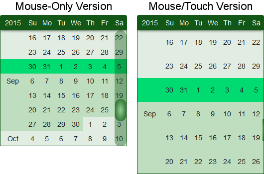
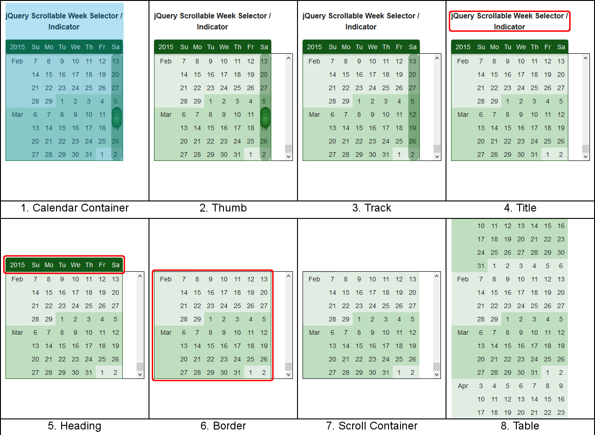
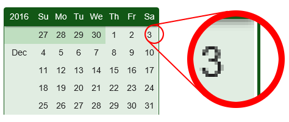

Scrollable Week Selector / Indicator
========
## jQuery calendar plugin that provides:

  * Smooth scrolling of a long (> 500 rows) table
  * Date selection by week (responds with Sunday's date)
  * Indication for previously selected weeks
  * Scroll track/thumb display on hover
  * Mouse-only and mouse/touch versions (difference in row height)
    * *Google requires that touch "tap targets" be at least 48 pixels high*

## Usage

Include the CSS file in the head section

    <link rel="stylesheet" href="Calendar.css" >
    
Add a div for the calendar in the body section

    

    
Add jQuery, the calendar plugin, and the JavaScript code to initiate the calendar

    
    

    

#### setWeek function
For scrolling to a specific week, create a handle to the calendar plugin, and then call the setWeek function passing the desired week as a parameter.

    $calendarHandle = $("#week-select-calendar").data("plugin_scrollableCalendar");
    
    $calendarHandle.setWeek("2015-09-02");
    
The date should be a Sunday.

## Demos
[Simple demo](http://richdebourke.github.io/scrollable-week-selector/simple.html) - Just the calendar.

[Full function demo](http://RichDeBourke.github.io/scrollable-week-selector) - Calendar with week selection/indication capability and a demo of the setWeek function.

[In operation](http://goo.gl/Dk18xU) - Calendar in operation.

## Options

  * **startDate:** "2012-01-01" - calendar start date (*should be a Sunday*)
    * *All dates must be in the YYYY-MM-DD format*
  * **endDate:** "2022-01-22" - calendar end date (*should be a Saturday*)
  * **currentWeek:** "latest-week" or a date ~ "2016-01-03" (*should be a Sunday*)
    * *The current week is positioned at the third row (if there are enough weeks after that week in the calendar) or at the bottom of the calendar (if the current week is the latest week)*
    * *If "latest-week", the endDate week will be set as the current week*
    * *There is no validation of the date text string*
  * **highlight:** true/false
    * *If true, the current week will be highlighted with a different background color*
  * **readWeeks:** [] - array of true/false for week status
    * *If the array is empty, no weeks are indicated* 
  * **dayNames:** ["Su", "Mo", "Tu", "We", "Th", "Fr", "Sa"]
    * *Revise for other languages, if desired*
  * **monthNames:** ["Jan", "Feb", "Mar", "Apr", "May", "Jun", "Jul", "Aug", "Sep", "Oct", "Nov", "Dec"]
    * *Revise for other languages, if desired*
  * **calendarTitle:** "" (*if blank, there is no title*)   
  * **touch:** true/false (*if true, calendar row heights are the touchRowHeight*)
  * **thumbHeight:** 45 - All heights are in pixels
  * **touchRowHeight:** 48
    * *48 is to make the row height comply with Google's mobile touch target size*
  * **nonTouchRowHeight:** 29
  * **onClick:** function () { alert(this); }
    * *Replace with your own function* 

#### readWeeks Array

The readWeeks array is an array of true/false with at least the same number of elements as there are weeks in the calendar. Element [0] is the status for the first week in the calendar. *There is no validation for the array.*

    [true, true, true, true, true, true, false, ... false]
    
*Please refer to my JavaScript plugin, [Binary Store/Retrieve](https://github.com/RichDeBourke/javascript-binary-data-storage), for saving and retrieving status data for weeks that have been visited.*

#### onClick function
Clicking with the mouse or tapping with a finger anywhere in a row will call the onClick function and pass a date string for Sunday's date for the week that was clicked/tapped to the function (the value of `this` is the date string). This can be used, for example, to change to a different URL:

    onClick: function () {
      window.location.assign(this);
    }

## How the plugin works

#### Setup the container

  This plugin changes the selected div from this:
  
    

    
  to this:
    
    

        

        <table class="calendar-table calendar-heading-table">
        

            <class="calendar-scrollContainer">
                <table class="calendar-table calendar-weeks-table">
            

            

        

    

The calendar consists of eight main components:
  1. Calendar container
    * Top layer that has overflow set to hidden to hide the scrollbar associated with the scroll container
  2. Thumb
    * Displayed when the mouse is over the scroll area (*a wide thumb is displayed*) or during touch scrolling (*a narrow thumb is displayed*)
    * As the thumb is dragged by the mouse, the scroll container's scrollTop value is adjusted
  3. Track
    * Displayed when the mouse is over the scroll area
    * Clicking on the track will move the calendar up or down
  4. Calendar title
    * Optional title
  5. Calendar heading table
    * Displays the current year and the days-of-the-week headings
  6. Calendar border
    * Provides the calendar's side and bottom borders
    * *There is no overflow setting on this layer as setting overflow: hidden for this layer could cause a gap between the table and the border in Internet Explorer 11 & Edge (see the section on Resolved technical difficulties below for more info about the gap)*
  7. Calendar scroll container
    * The scroll container is set to overflow: auto creating a standard browser vertical scrollbar on the right side of the container
    * *The scroll container is wider than the table (by 47px). This creates a space between the calendar's scrollbar and browser's scrollbar. The space prevents the cursor from reverting to the standard pointer if the user moves the mouse slightly to the right while dragging the thumb.*
  8. Calendar weeks table
    * Each row in the table is one week
  

#### Create the table
The plugin uses a date object and loops to build the table. The date object is set to the starting date. An outer loop is used to create the weeks and an inner loop is used to create the days, incrementing the date object each day.

#### Mouse-Only & Mouse/Touch
There are two calendar configurations, mouse-only and mouse/touch. The mouse-only version displays 8 weeks at a time and each week is 29 pixels high. The mouse/touch version displays 6 weeks at a time and each week is 48 pixels high (to match Google's requirement for touch-targets to be at least 48 pixels to be considered mobile friendly).

To determine if the browser could be touch capable, the following code can be run before calling the plugin, and the results passed to the calendar plugin:

    if (('ontouchstart' in window) ||
      (window.DocumentTouch && document instanceof DocumentTouch) ||
      (navigator.MaxTouchPoints > 0) ||
      (navigator.msMaxTouchPoints > 0)) {
              touchStatus = true;
          } else {
              touchStatus = false;
          }

 It may be possible to get a false-positive with this method from some hardware / browser combinations (the browser thinks it has touch, but the hardware doesn't support touch). A false-positive should be acceptable for most applications as the mouse/touch configuration works with both a mouse and touch, so the user will have full functionality. The difference is the user will see only six (taller) rows instead of eight rows if there is a false positive.

#### Use CSS opacity to hide/show the thumb & track
The CSS for the track & thumb are set to opacity: 0 and the values are changed when the mouse is hovering over the table. At the mousedown event for the thumb, a class is added to the track & thumb to keep the opacity at 1 while the mouse is dragging the thumb (in case the mouse pointer leaves the table area).

#### Indicating the status for each week
As the table is built, an array that was passed to the plugin is used to identify which weeks have been visited.

#### Request Animation Frame
The plugin uses animation frames and it throttles (limits) drag and scroll requests to one per animation request. *I don't have specific numbers on the improvement, but throttling does seem to improve performance.*

## Why another calendar plugin
I wanted a calendar for a [page on my website](http://goo.gl/Dk18xU) that could scroll via the mouse (by dragging a scrollbar or using the scroll wheel) or a finger on a touch device, that would support selecting a week (rather than a single day), and that would indicate which weeks had already been selected. I've used  [Tiny Scrollbar](https://github.com/wieringen/tinyscrollbar) for other projects, but when  I used it to position the calendar table within the container division, the motion was very slow. This is because Tiny Scrollbar uses absolute positioning to position the scroll content. Changing a top value is slower than changing a scrollTop value (as demonstrated by a [js*Perf* test case](http://jsperf.com/scrolltop-vs-absolute-position)).

I looked at other calendar plugins and found [jQuery Continuous Calendar](https://github.com/continuouscalendar/jquery-continuous-calendar). That plugin has a nice scrolling action as it setup overflow for the table as scroll. While it worked nicely, I didn't like the browser's default scrollbar stuck on the side of the calendar.

That's when I found yairEO's [fakescroll](https://github.com/yairEO/fakescroll). It hides the browser's scrollbar, replacing it with its own. This makes it possible for the scrollbar to be styled and positioned over the table.

Combining the custom scrollbar from [fakescroll](https://github.com/yairEO/fakescroll) with the table from [jQuery Continuous Calendar](https://github.com/continuouscalendar/jquery-continuous-calendar) gave me what I wanted.

## Resolved technical difficulties
Making something work across all platforms runs into complications. While most questions are answered with a Google search, occasionally something comes up that's not easily resolved. That's why I'm noting a couple of difficulties I ran into and what I did to make things work the way I wanted.

#### overflow: hidden and margin: auto on IE & Edge
The version of the scroll calendar page used a grid (Foundation 5) and the border layer was set to overflow: hidden to hide the browser's scrollbar. For putting the plugin on Github, I used a container div that was centered on the page using margin: auto.

On Microsoft browsers (IE11 & Edge) a white "gap" appeared on the right side of the layout, between the table and border (there wasn't any issue with margin: auto on Chrome, Firefox, or Safari). The gap would only show if the parent div had an odd number of pixels such that the auto margin on each side ended with .5px.

My solution was to add a layer on top with that layer's overflow set to auto so that layer would hide the browser's scrollbars.

#### :hover for devices with both a mouse and touch
I initially used hover on the scroll container to trigger the thumb and track displaying, but that causes a problem on a touch device. Tapping the table caused hover to be "on" and it wouldn't turn off, leaving the thumb/track displayed all of the time. That wouldn't have been an issue for me, as I'm using the calendar to switch to a new URL, but in the interest of having a cleaner solution, I wanted something that could turn the thumb/track on and off.

I switched from using hover to using listeners for *mouseenter*, *mouseleave*, and *click* on the border layer. A mouse will trigger the enter and leave events, and a tap will trigger the *mouseenter* (on Android) and *click* events (there's no *mouseleave* event with a tap, which is why I use *click* to clear the displaying of the thumb/track). A tap on Safari on the iPhone, according to the [Apple site](https://developer.apple.com/library/ios/documentation/AppleApplications/Reference/SafariWebContent/HandlingEvents/HandlingEvents.html), triggers a *mousedown*, which, since I'm not listening for it, will not trigger the display of the thumb/track.

## Compatibility

The calendar plugin has been confirmed to work with the latest versions of:

* IE 9 & 11 *(CSS gradients don't work on IE9, but everything else works)*
* Edge (desktop & Surface)
* Chrome (mobile & desktop)
* Firefox
* Android Internet
* Safari (mobile & desktop)

*The plugin will not work with older versions of IE (I use jQuery 2.1.4). My view is it is time to stop supporting older browsers. I do provide a notice that because of the older browser someone is using, they won't be able to properly utilize my site.*

## License

This plugin is provided under the [MIT license](http://opensource.org/licenses/mit-license.php).
